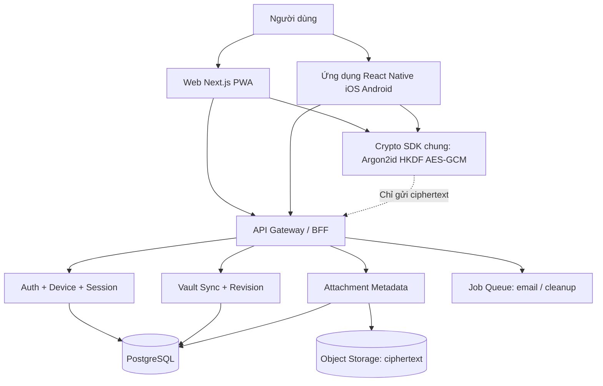

# Sơ đồ architecture

```mermaid
flowchart TB
 U[Người dùng] --> W[Web Next.js PWA]
 U --> M[Ứng dụng React Native iOS Android]
 W --> C[Crypto SDK chung: Argon2id HKDF AES-GCM]
 M --> C
 W --> A[API Gateway / BFF]
 M --> A
 A --> AUTH[Auth + Device + Session]
 A --> SYNC[Vault Sync + Revision]
 A --> FILE[Attachment Metadata]
 AUTH --> DB[(PostgreSQL)]
 SYNC --> DB
 FILE --> DB
 FILE --> OBJ[(Object Storage: ciphertext)]
 A --> QUEUE[Job Queue: email / cleanup]
 C -. Chỉ gửi ciphertext .-> A
```
