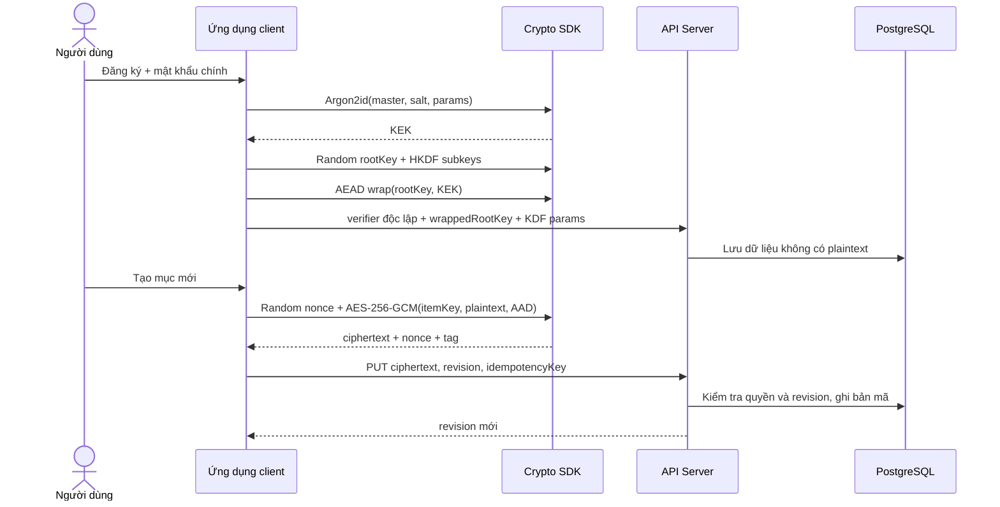

# Sơ đồ encryption-flow

```mermaid
sequenceDiagram
 actor U as Người dùng
 participant App as Ứng dụng client
 participant Crypto as Crypto SDK
 participant API as API Server
 participant DB as PostgreSQL
 U->>App: Đăng ký + mật khẩu chính
 App->>Crypto: Argon2id(master, salt, params)
 Crypto-->>App: KEK
 App->>Crypto: Random rootKey + HKDF subkeys
 App->>Crypto: AEAD wrap(rootKey, KEK)
 App->>API: verifier độc lập + wrappedRootKey + KDF params
 API->>DB: Lưu dữ liệu không có plaintext
 U->>App: Tạo mục mới
 App->>Crypto: Random nonce + AES-256-GCM(itemKey, plaintext, AAD)
 Crypto-->>App: ciphertext + nonce + tag
 App->>API: PUT ciphertext, revision, idempotencyKey
 API->>DB: Kiểm tra quyền và revision, ghi bản mã
 API-->>App: revision mới
```
