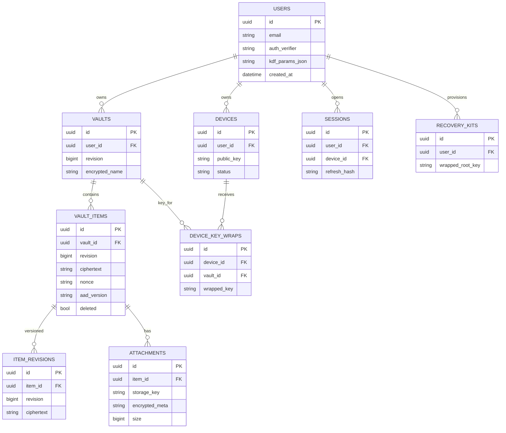

# Sơ đồ erd

```mermaid
erDiagram
 USERS ||--o{ DEVICES : owns
 USERS ||--o{ VAULTS : owns
 USERS ||--o{ SESSIONS : opens
 USERS ||--o{ RECOVERY_KITS : provisions
 VAULTS ||--o{ VAULT_ITEMS : contains
 VAULT_ITEMS ||--o{ ITEM_REVISIONS : versioned
 VAULT_ITEMS ||--o{ ATTACHMENTS : has
 DEVICES ||--o{ DEVICE_KEY_WRAPS : receives
 VAULTS ||--o{ DEVICE_KEY_WRAPS : key_for
 USERS { uuid id PK string email string auth_verifier string kdf_params_json datetime created_at }
 DEVICES { uuid id PK uuid user_id FK string public_key string status }
 VAULTS { uuid id PK uuid user_id FK bigint revision string encrypted_name }
 VAULT_ITEMS { uuid id PK uuid vault_id FK bigint revision string ciphertext string nonce string aad_version bool deleted }
 ITEM_REVISIONS { uuid id PK uuid item_id FK bigint revision string ciphertext }
 ATTACHMENTS { uuid id PK uuid item_id FK string storage_key string encrypted_meta bigint size }
 DEVICE_KEY_WRAPS { uuid id PK uuid device_id FK uuid vault_id FK string wrapped_key }
 SESSIONS { uuid id PK uuid user_id FK uuid device_id FK string refresh_hash }
 RECOVERY_KITS { uuid id PK uuid user_id FK string wrapped_root_key }
```
